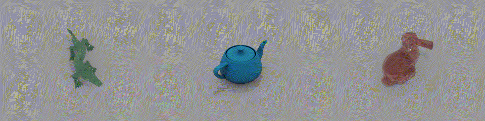

<h1 align="center"> PyBlend </h1>

<p align="center">
    <b>PyBlend is a Python library for <a href="https://www.blender.org/">Blender</a>. It provides a lot of valuable functions for Blender scripting.</b>
</p>
<p align="center">
    
    <p align="center">
        <b>Figure 1.</b> <i>Depth maps, random material images, and normal maps rendered using PyBlend with the Stanford Bunny.</i>
    </p>
</p>

## Installation

Setting up the environment for Python in Blender is a challenge. However, following the steps below, you can easily configure the environment.

1. Download Blender from [here](https://www.blender.org/download/).
    
    Note: if your project has strict environmental requirements, you must carefully select the version of Blender. Currently, there appears to be **NO** official release of Blender that directly supports Python 3.8, which can be verified from [blender/tags](https://github.com/blender/blender/tags). Here I use `blender-3.3.1-linux-x64.tar.xz` for Linux users with Python 3.10.2.
    Once you unzip the file, you will find a folder structured like this:

    ```bash
    ./blender-3.3.1-linux-x64
    ├── blender
    ├── 3.3
    ...
    ```
    where `blender` is the executable file (I will use `{path/to/blender}` or `blender_app` to represent this path in the following) and `3.3` contains the Python environment for Blender.

2. Download `get-pip.py` and install pip for Blender Python.

    ```bash
    $ wget https://bootstrap.pypa.io/get-pip.py

    $ ./blender-3.3.1-linux-x64/3.3/python/bin/python3.10 get-pip.py
    ```

3. Install PyBlend.

    ```bash
    $ ./blender-3.3.1-linux-x64/3.3/python/bin/pip install git+https://github.com/anyeZHY/PyBlend.git
    ```

4. You could install other packages in the same way. E.g.,

    ```bash
    $ ./blender-3.3.1-linux-x64/3.3/python/bin/pip install torch
    ```


## Usage
I recommend you use `alias blender_app='{path/to/blender}'` to simplify the command.

### 1. Render Normal and Depth Images

Similar to teaser.gif, you can use PyBlend to render both normal and depth images. By using the following command, you can generate 60 images ranging from 0 to 60 degrees.

```shell
$ blender_app -b -P scripts/teaser.py -- --begin 0 --end 60
```

### 2. OBJ in, Multi-view Images out
<br>
<p align="center">
    
    <p align="center">
        <b>Figure 2.</b> <i>Multi-view images rendered using PyBlend with the XYZ Dragon, teapot, and Stanford Bunny.</i>
    </p>
</p>

With PyBlend, you can effortlessly render multi-view images from a single OBJ file. Using the provided command, you’ll be able to generate an impressive set of 30 images. Additionally, you have the option to assign HEX color to the object using the `--color` argument. A big thank you to [Silvia Sellán](https://www.silviasellan.com) for generously sharing her insightful [blog](https://research.siggraph.org/blog/guides/rendering-a-paper-figure-with-blender/)!

```shell
$ blender_app -b -P scripts/multi_view.py -- --obj_path data/bunny.obj --name bunny --num_views 30

$ blender_app -b -P scripts/multi_view.py -- --obj_path data/dragon.obj --name dragon --num_views 30 --color 127EB4
```

## TODO
**Still under development. More functions will be added soon.**

- [x] Add visualization scripts.

- [ ] Add instructions for rendering.

- [ ] Add animation and physics simulation functions.

- [ ] Add [Objaverse](https://objaverse.allenai.org) extension.

## Other Resources
- [Blender Python API](https://docs.blender.org/api/current/index.html)
- [DLR-RM/BlenderProc](https://github.com/DLR-RM/BlenderProc)
- [yuki-koyama/blender-cli-rendering](https://github.com/yuki-koyama/blender-cli-rendering)
- [njanakiev/blender-scripting](https://github.com/njanakiev/blender-scripting)
